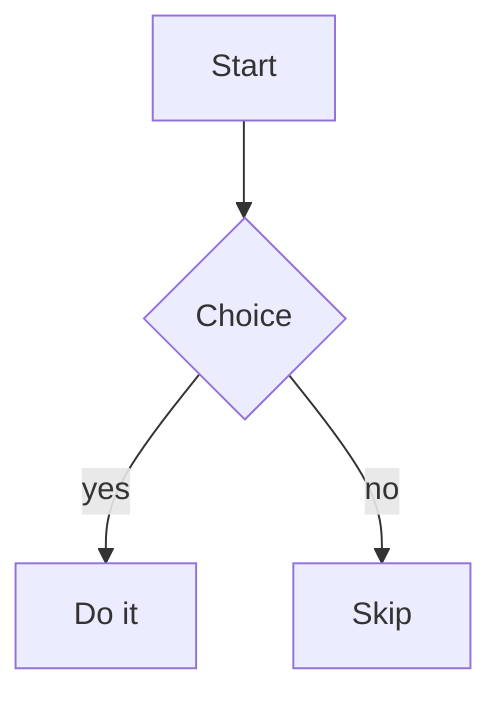

# mdrfc

A markdown viewer for the browser and the terminal. RFC style: monospace, 72 columns.

```sh
mdrfc README.md          # open in the browser, reloads when you save
mdrfc docs/              # a folder, with a sidebar of every .md file
mdrfc README.md --term   # render in the terminal instead
cat foo.md | mdrfc       # stdin works too
```

## Install

```sh
npx mdrfc README.md      # no install
npm install -g mdrfc     # or keep it around
```

Needs [Node](https://nodejs.org) 20 or newer. Also runs under Bun and Deno.

## Usage

```
mdrfc [file|dir]          open in the browser
mdrfc [file] --term       render to the terminal
mdrfc                     read markdown from stdin

FLAGS
  -w, --web                 open in the browser (the default)
  -t, --term                render to the terminal instead
  -p, --port <n>            server port (default 2119)
      --no-open             don't open a browser tab
      --no-color            plain text, no ANSI colour
      --no-frontmatter      hide the frontmatter block
      --width <n>           content width in columns (default 72)
      --theme <auto|light|dark>
      --toc <off|top|left|right>   table of contents (default right)
  -h, --help
  -V, --version
```

Piping picks the terminal for you, so `mdrfc x.md | grep foo` and
`mdrfc x.md > out.txt` print text instead of opening a tab. So does an SSH
session with no display. Pass `--web` to open a tab anyway.

## In the browser

- **Live reload** — save the file, the page updates and keeps your place.
- **Cmd-K** — search headings, filenames and text, and jump to the result. The
  line you picked is highlighted; **Esc** clears it.
- **Table of contents** — in the right margin by default, and it follows you
  down the page. Move it with `--toc` or the settings panel.
- **Heading links** — click the `#` beside a heading to jump there and copy the
  link. Slugs match GitHub's.
- **Images** — `` loads the file from beside the document, and
  redraws when you save over it.
- **Reading position** — each document reopens where you left off.
- **Settings** — the gear button: theme, font, text size, width, table of
  contents. All remembered in your browser.
- **Folders** — `mdrfc docs/` lists every `.md` file in a sidebar, grouped by
  folder. New files appear without a restart.

## In the terminal

`--term` renders RFC-style text, reflowed to 72 columns and paged through
`less`. `--no-color` drops the colour for plain text. Given a folder, it prints
the file tree, then the folder's `README.md`.

## Width

72 columns by default, in both views.

```sh
mdrfc README.md --width 80
```

The settings panel has a width slider (40–200 columns) that overrides it.

## Frontmatter

A YAML (`---`) or TOML (`+++`) block at the top of the file is shown as a
metadata header rather than as body text, and `title` becomes the page title.

```markdown
---
title: RFC 9999 — Widget Protocol
author: Riad
tags: [rfc, draft]
---

# Introduction
```

`--no-frontmatter` hides the header. Malformed frontmatter is ignored rather
than fatal.

## Mermaid diagrams

A ```` ```mermaid ```` fence is drawn as a diagram in the browser.

````

````

Click a diagram (or press `open` in its toolbar) to fill the window with it:

| | |
|---|---|
| drag, arrow keys | pan |
| wheel, pinch, `+` `-` | zoom |
| double-click | zoom in there |
| `0` | fit to the window |
| Esc, `close`, click past it | close |

Diagrams follow the page theme, and mermaid ships with mdrfc, so nothing is
fetched from the network. If a diagram won't parse, you get the source you
wrote and the reason underneath it. The terminal view leaves a mermaid fence as
a code block.

## Font

Pages are set in [Iosevka Brick](https://github.com/riadafridishibly/Iosevka-Brick),
which ships with mdrfc, so a machine with no monospace font of its own reads
the same as one with a dozen. Pick another family in the settings panel — it
searches every font installed on your machine — and that choice sticks.

## Contributing

See [CONTRIBUTING.md](CONTRIBUTING.md) for running from a clone.

## License

MIT — see [LICENSE](https://github.com/riadafridishibly/mdrfc/blob/main/LICENSE).
